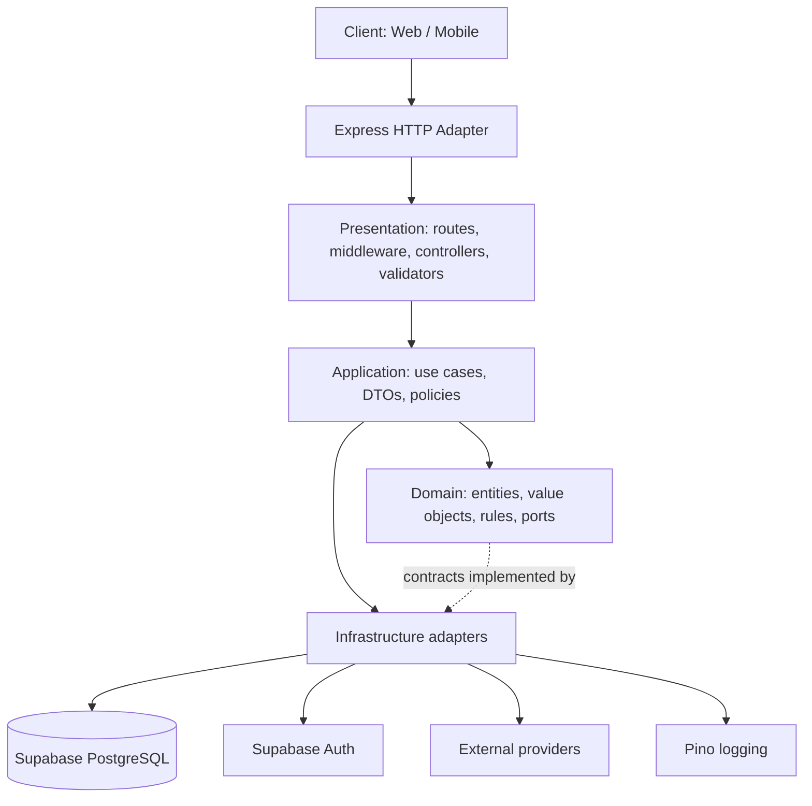
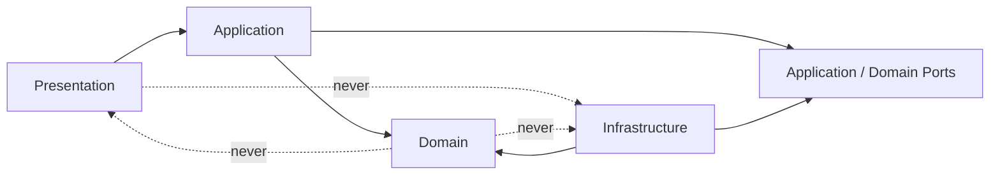

# AutoLead Backend Architecture

**Status:** Normative engineering specification  
**Scope:** Express API and backend services  
**Audience:** Human developers and AI coding assistants  
**Applies to:** All production backend code, migrations, integrations, and feature modules

This document is the architectural source of truth for the AutoLead Backend. If an implementation conflicts with this document, the implementation MUST be changed or an explicit architecture decision MUST supersede the relevant rule. Product behavior is defined by the PRD; this document defines how that behavior is implemented.

The backend is a modular monolith. It MUST remain deployable as one service while preserving boundaries that permit selected modules to become independent services later. The initial system uses Node.js 22 LTS, Express, strict TypeScript, Supabase PostgreSQL, Supabase Auth, `@supabase/supabase-js`, Zod, Pino, Vitest, Supertest, Docker, GitHub Actions, and pnpm.

## 1. Purpose

This document defines the structural, dependency, data-access, and runtime rules for the AutoLead Backend. It specifies where responsibilities live, how requests cross boundaries, how features are organized, and which dependencies are permitted.

The goals are to:

- keep business rules independent of Express and Supabase;
- make use cases executable without an HTTP server or database;
- isolate persistence and external providers behind interfaces;
- enforce authorization in application policy boundaries;
- make feature work predictable for developers and AI agents;
- support incremental growth without prematurely introducing distributed-system complexity.

## 2. Architectural Principles

### 2.1 Separation of Concerns

Each module MUST have one primary reason to change. HTTP transport, application orchestration, domain rules, persistence, configuration, and external providers MUST be separate concerns.

**Enforcement rules:**

- Controllers MUST translate HTTP input/output only.
- Use cases MUST orchestrate application behavior.
- Entities and value objects MUST enforce domain invariants.
- Repositories MUST own persistence details.
- Mappers MUST translate between persistence, domain, and API representations.
- Provider SDK calls MUST be isolated behind infrastructure adapters.

### 2.2 Dependency Rule

Dependencies MUST point inward toward stable policy. Domain code MUST NOT depend on application, presentation, or infrastructure code.

**Enforcement rules:**

- Domain imports MAY reference only domain and approved language/runtime primitives.
- Application MAY depend on domain contracts and shared kernel code, but MUST NOT import Express or Supabase.
- Infrastructure MAY implement application/domain interfaces.
- Presentation MAY depend on application contracts and shared transport utilities.
- Dependency direction MUST be established in the composition root, not by service locators.

### 2.3 Single Responsibility

A component MUST have one cohesive responsibility and one primary axis of change.

### 2.4 Explicit Dependencies

Required collaborators MUST be visible in constructors or factory arguments. Global mutable clients MUST NOT be accessed directly by application or domain code.

### 2.5 Composition over Inheritance

Behavior SHOULD be assembled from focused collaborators and policies rather than deep class hierarchies.

### 2.6 Fail Fast

Invalid configuration, malformed input, and impossible state transitions MUST be rejected at the earliest boundary that can detect them.

- Configuration MUST be parsed at startup with a schema.
- HTTP input MUST be validated before a use case executes.
- Domain constructors/factories MUST reject invalid invariants.

### 2.7 Security by Design

Authorization, least privilege, and sensitive-data handling MUST be part of the flow design.

**Enforcement rules:**

- Every command/query MUST establish the authenticated actor where required.
- Authorization MUST be enforced in application policy/use-case boundaries and backed by database controls where applicable.
- Service-role Supabase credentials MUST remain infrastructure-only and MUST NOT be exposed to clients.
- Sensitive data MUST NOT be logged.

### 2.8 Testability

Business behavior MUST be runnable with in-memory or fake interfaces and without Express, Supabase, or network access where avoidable.

### 2.9 Scalability

The system MUST scale by adding instances and isolating expensive or asynchronous work.

- API instances MUST be stateless.
- Pagination MUST be enforced for collection endpoints.
- Long-running or retryable work MUST move to jobs/queues.

### 2.10 Simplicity

The architecture MUST use the least complex mechanism that satisfies current requirements. A module MUST NOT be extracted into a service without an operational or scaling reason.

### 2.11 Open/Closed

Business behavior MUST be extensible by adding new code (new adapters, new policies, new value-object variants) rather than by editing the internals of existing, already-tested use cases.

### 2.12 Interface Segregation

A consumer MUST depend only on the operations it actually calls. Repository interfaces MUST be segregated into command repositories and query interfaces per §10.

## 3. High-Level Architecture



## 4. Clean Architecture

### 4.1 Presentation

**Responsibilities:** route registration, request context creation, authentication middleware integration, input validation, controller invocation, error-to-HTTP translation, and response serialization.

**Forbidden responsibilities:** business rules, database queries, Supabase SDK calls, transaction management, domain calculations.

### 4.2 Application

**Responsibilities:** use cases, application services, command/query orchestration, authorization policy invocation, transaction boundary selection, DTO definitions, and coordination of repositories and external ports.

**Forbidden responsibilities:** Express response handling, Supabase queries, SDK-specific types, raw database row manipulation.

### 4.3 Domain

**Entities:** identity-bearing objects with lifecycle rules.  
**Value Objects:** invariant-bearing concepts that are immutable.  
**Repository Interfaces:** domain-oriented operations, not vendor-shaped CRUD.  
**Business Rules:** state transitions and calculations enforced in domain code.

**Forbidden dependencies:** Express, Supabase, `@supabase/supabase-js`, Pino, environment variables, HTTP status codes.

### 4.4 Infrastructure

**Responsibilities:** repository implementations, Supabase client construction, persistence mappers, Auth integration, logging, configuration loading, queue/job adapters, file storage, and third-party integrations.

## 5. Dependency Rule



### Allowed dependencies

- Presentation MAY import application contracts and transport utilities.
- Application MAY import domain and port interfaces.
- Infrastructure MAY import application/domain interfaces and concrete SDKs.
- Composition root MAY import every layer to assemble the system.

### Forbidden dependencies

- Domain MUST NOT import any outer layer.
- Application MUST NOT import Express, Supabase, or provider SDKs.
- Presentation MUST NOT import concrete repositories or Supabase clients.
- Features MUST NOT reach into another feature's infrastructure implementation.

## 6. Folder Structure

```text
src/
├── app/
│   ├── composition-root.ts
│   ├── http-server.ts
│   └── routes.ts
├── features/            # vertical business slices (added as capabilities land)
├── domain/
│   ├── shared/
│   └── errors/
├── infrastructure/
│   ├── supabase/
│   ├── auth/
│   ├── logging/
│   └── providers/
├── presentation/
│   ├── http/
│   │   ├── middleware/
│   │   └── errors/
│   └── validation/
├── shared/
│   ├── result/
│   ├── pagination/
│   └── primitives/
└── config/
    ├── environment.ts
    └── constants.ts
```

`app/` is the composition root and runtime assembly. `features/` owns vertical business slices. `domain/` contains shared domain primitives and errors only. `infrastructure/` owns all vendor and persistence implementations. `presentation/` owns framework adapters shared across features. `shared/` is for framework-neutral, non-domain utilities. `config/` owns startup configuration.

## 7. Feature Module Structure

Each feature MUST be independently understandable and MUST expose only its public application/presentation surface.

```text
features/vehicles/
├── domain/
├── application/
├── presentation/
├── infrastructure/
├── composition.ts
└── tests/
```

`composition.ts` constructs the feature's repositories and use cases from shared infrastructure passed in by the composition root. It MUST NOT be imported by the feature's own domain, application, or presentation code.

Features MUST align with business capabilities, not database tables. Cross-feature workflows MUST be orchestrated in application code through public use-case contracts.

## 8. Request Lifecycle

**Write (command):**

```text
HTTP Request → Middleware → Validator → Controller → Command → Use Case
→ Entity/VO → Policy → Command Repository → Supabase
```

**Read (query):**

```text
HTTP Request → Middleware → Validator → Controller → Query → Use Case
→ Query Interface → Supabase → Read-model DTO → Serializer
```

The query path deliberately does not reconstruct a domain Entity — query interfaces return read-model DTOs shaped for the screen requesting them.

## 9. Layer Responsibilities

| Component | Must Do | Must Never Do |
| --- | --- | --- |
| Controllers | Accept validated input, call one use case, serialize result | Query Supabase, calculate business rules |
| Middleware | Authenticate, attach context, enforce generic policies | Execute feature workflows |
| Validators | Parse and reject malformed input | Perform authorization or persistence queries |
| Use Cases | Authorize, enforce workflow rules, call ports | Import Express/Supabase or shape HTTP responses |
| Entities | Protect invariants and valid state transitions | Read configuration, call SDKs |
| Value Objects | Make invalid values unrepresentable | Perform I/O |
| Repository Interfaces | Define domain-oriented operations | Mention Supabase, SQL, or SDK types |
| Repository Implementations | Scope queries, map rows, translate errors | Define business workflows |
| Mappers | Convert persistence/domain/API shapes explicitly | Authorize or persist |
| DTOs | Define stable boundary data | Act as mutable domain entities |

## 10. Repository Pattern

Repository interfaces MUST be segregated by consumer shape (logical CQRS — see [ADR-0001](./adr/0001-logical-cqrs-for-repository-interfaces.md)): a narrow **command repository** for invariant-preserving lookups and writes, and a separate **query interface** for listing, filtering, and reporting.

```ts
interface VehicleRepository {
  findById(id: VehicleId): Promise<Vehicle | null>;
  save(vehicle: Vehicle): Promise<void>;
}

interface VehicleQueries {
  listInventory(criteria: InventoryCriteria, page: Pagination): Promise<Page<VehicleSummary>>;
}
```

Supabase MUST NEVER be used outside repository/query implementations and other explicitly designated infrastructure adapters.

### Mapping

Persistence rows MUST be mapped to domain entities before application logic uses them. API DTOs MUST be separately mapped so schema changes do not expose database structure.

### Pagination and filtering

Collection queries MUST use explicit pagination with a maximum page size. Filters MUST be represented by typed criteria objects and MUST be allowlisted.

When a feature introduces ownership or scope predicates (e.g. filtering by salesperson or dealership), repositories MUST require those as explicit arguments and apply them in every query.

### Transactions

A use case that changes multiple records atomically MUST execute through a transaction port. Transaction boundaries belong to application workflows; transaction mechanics belong to infrastructure.

### Error handling

Repositories MUST translate Supabase/PostgreSQL errors into typed infrastructure errors: `NotFound`, `Conflict`, `UniqueViolation`, `TransientDatabaseFailure`, `DatabaseUnavailable`.

## 11. Dependency Injection

The **composition root** is `src/app/composition-root.ts`. Each feature MUST export its own composition unit (`features/<name>/composition.ts`). `composition-root.ts` MUST only call each feature's composition unit and wire cross-feature dependencies explicitly.

Constructor injection is mandatory for required dependencies. Use cases MUST NOT receive `Express.Request`, `Express.Response`, a raw Supabase client, or a generic service locator.

## 12. Database Access Strategy

Supabase PostgreSQL is the system of record. Supabase Auth is the identity provider.

- Repositories own table access and MUST enforce ownership predicates when a feature defines them.
- Row Level Security (RLS) SHOULD provide defense-in-depth but MUST NOT replace application authorization.
- Schema changes MUST be represented by reviewed, forward-applied SQL migrations.
- Soft deletes use `deleted_at timestamptz NULL` (null = live). See [ADR-0005](./adr/0005-soft-delete-via-deleted-at.md).
- Audit records SHOULD be written for sensitive actions designated by the product.
- Domain and application contracts MUST not contain Supabase query-builder types or Auth-specific session objects.

## 13. Error Propagation

```text
Validation Errors → Domain Errors → Infrastructure Errors → Application Errors → HTTP Response
```

The presentation error handler MUST map known errors to stable HTTP status codes and safe response bodies. Unknown errors MUST map to a generic 500 with no leaked internals.

## 14. Validation Rules

| Question | Lives in | Fails if skipped |
| --- | --- | --- |
| Is the field present / right JSON type? | Zod schema | Malformed requests reach business code |
| Is this a valid value by business definition? | Value Object | Non-HTTP entry points can create invalid data |
| Is this operation allowed given other data/context? | Policy | Business invariants can be violated |

Zod schemas MUST delegate to Value Object `create()` via `superRefine`, never re-implement the rule.

## 15. Future Scalability

- **Background jobs:** scheduled reminders, sync, and notification delivery MUST use application job handlers invoked by an infrastructure scheduler.
- **Queues:** when latency, retries, or fan-out justify it, an infrastructure queue adapter MAY be introduced without changing use cases.
- **File storage:** uploads MUST use a storage port with Supabase Storage as an infrastructure implementation.
- **Microservice extraction:** a feature MAY become a service only when it has an independent scaling, availability, or deployment requirement.

## 16. Architecture Compliance Checklist

Every pull request that changes backend behavior MUST be reviewable against this checklist:

- [ ] The change belongs to the correct feature module.
- [ ] Controllers contain no business logic, persistence access, or provider calls.
- [ ] Use cases are independent of Express, Supabase, and provider SDKs.
- [ ] Domain entities/value objects have no infrastructure or presentation dependencies.
- [ ] Repository interfaces are domain-oriented and inward-facing.
- [ ] Repository implementations are the only application persistence adapters for Supabase.
- [ ] DTOs are used at application/HTTP boundaries; database rows are not returned directly.
- [ ] Authorization is enforced at the application boundary.
- [ ] Multi-record state changes use an explicit transaction boundary where atomicity is required.
- [ ] Collection queries have bounded pagination and typed filters.
- [ ] Configuration is parsed at startup and is not read by business logic.
- [ ] Errors are typed, translated at the correct boundary, and safely serialized.
- [ ] Sensitive values are excluded from logs.
- [ ] No dependency rule violation has been introduced.
- [ ] Business logic has focused tests that do not require Express or Supabase.

## 17. Rule of Thumb

When adding new code, ask in order:

1. Is this HTTP-specific? → **Presentation**.
2. Is this orchestration of a business workflow? → **Application**.
3. Is this a business rule, invariant, or calculation? → **Domain**.
4. Is this persistence or a call to an external system? → **Infrastructure**.
5. Is it a read for display/reporting with no invariant to protect? → **Application query + Query Interface** (§10).

If unsure, default to keeping the logic closer to the Domain than the framework.
